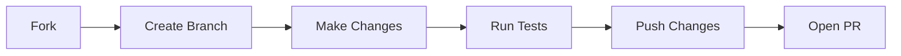

<a name="readme-top"></a>

<!--
╔═══════════════════════════════════════════════════════════════════════════╗
║                                                                           ║
║   ███╗   ██╗███████╗██╗  ██╗██╗   ██╗███████╗                            ║
║   ████╗  ██║██╔════╝╚██╗██╔╝██║   ██║██╔════╝                            ║
║   ██╔██╗ ██║█████╗   ╚███╔╝ ██║   ██║███████╗                            ║
║   ██║╚██╗██║██╔══╝   ██╔██╗ ██║   ██║╚════██║                            ║
║   ██║ ╚████║███████╗██╔╝ ██╗╚██████╔╝███████║                            ║
║   ╚═╝  ╚═══╝╚══════╝╚═╝  ╚═╝ ╚═════╝ ╚══════╝                            ║
║                                                                           ║
║   Your Local AI Command Center | 您的本地AI智能中枢                        ║
║                                                                           ║
╚═══════════════════════════════════════════════════════════════════════════╝
-->

<div align="center">


<br/>


<br/>
<br/>

<!-- Badges -->
<p>
  <a href="https://github.com/1822520752/Nexus/releases">
    
  </a>
  <a href="https://github.com/1822520752/Nexus/actions/workflows/release.yml">
    
  </a>
  <a href="https://github.com/1822520752/Nexus/releases">
    
  </a>
  <a href="LICENSE">
    
  </a>
</p>

<p>
  <a href="https://tauri.app/">
    
  </a>
  <a href="https://vuejs.org/">
    
  </a>
  <a href="https://fastapi.tiangolo.com/">
    
  </a>
  <a href="https://www.python.org/">
    
  </a>
  <a href="https://www.typescriptlang.org/">
    
  </a>
  <a href="https://ollama.ai/">
    
  </a>
</p>

<p>
  <a href="#english">🇺🇸 English</a> • <a href="#中文">🇨🇳 中文</a>
</p>

<!-- Star History -->
<a href="https://star-history.com/#1822520752/Nexus&Timeline">
 <picture>
   <source media="(prefers-color-scheme: dark)" srcset="https://api.star-history.com/svg?repos=1822520752/Nexus&type=Timeline&theme=dark" />
   <source media="(prefers-color-scheme: light)" srcset="https://api.star-history.com/svg?repos=1822520752/Nexus&type=Timeline" />
   
 </picture>
</a>

</div>

---

## 🇺🇸 English <a name="english"></a>

<table>
<tr>
<td width="50%">

### 🎯 What is Nexus?

**Nexus** is a **100% local** AI command center that unifies all AI models and executes local tasks automatically.

**Why Nexus?**

- 🔒 **Privacy First** - Your data never leaves your device
- ⚡ **Lightning Fast** - Native performance with Tauri v2
- 🧠 **Smart Memory** - Three-layer memory architecture
- 🔧 **Extensible** - Custom actions and scripts

</td>
<td width="50%">

### 📸 Preview

```
┌─────────────────────────────────────────────┐
│  🤖 Nexus                        ─ □ ×     │
├──────────────┬──────────────────────────────┤
│              │                              │
│  🎯 Models   │   💬 Chat with AI...        │
│  ├─ GPT-4    │   ┌──────────────────────┐  │
│  ├─ Claude   │   │ AI: Hello! I'm your  │  │
│  └─ Ollama   │   │ local assistant...   │  │
│              │   └──────────────────────┘  │
│  📁 Documents│                              │
│  📝 Actions  │   ┌──────────────────────┐  │
│  🧠 Memory   │   │ Type a message...    │  │
│  ⚙️ Settings │   └──────────────────────┘  │
│              │                              │
└──────────────┴──────────────────────────────┘
```

</td>
</tr>
</table>

### ✨ Core Features

<table>
<tr>
<td width="33%" align="center">
<a href="#unified-ai-access">

</a>
<br/><br/>
<p align="left">
<b>Multi-Model Support</b><br/>
• Ollama (Local)<br/>
• OpenAI GPT-4<br/>
• DeepSeek<br/>
• Claude, Gemini...
</p>
</td>
<td width="33%" align="center">
<a href="#knowledge-base">

</a>
<br/><br/>
<p align="left">
<b>RAG System</b><br/>
• PDF/MD/TXT Support<br/>
• Vector Search<br/>
• Hybrid Retrieval<br/>
• Smart Chunking
</p>
</td>
<td width="33%" align="center">
<a href="#action-engine">

</a>
<br/><br/>
<p align="left">
<b>Local Execution</b><br/>
• Secure Sandbox<br/>
• File Operations<br/>
• Custom Scripts<br/>
• Permission Control
</p>
</td>
</tr>
</table>

### 🧠 Three-Layer Memory Architecture

```
┌─────────────────────────────────────────────────────────────────┐
│                        MEMORY ARCHITECTURE                       │
├─────────────────┬─────────────────┬─────────────────────────────┤
│   ⚡ INSTANT    │   💼 WORKING    │      🗄️ LONG-TERM           │
│   ────────────  │   ────────────  │      ────────────           │
│   100K tokens   │   Minute-level  │      Cross-session          │
│   Sliding Window│   Knowledge     │      Persistent Storage     │
│   Context Mgmt  │   Graph + Vector│      Importance Scoring     │
└─────────────────┴─────────────────┴─────────────────────────────┘
```

### 🚀 Quick Start

```bash
# 1️⃣ Clone the repository
git clone https://github.com/1822520752/Nexus.git
cd Nexus

# 2️⃣ Install dependencies
npm install                           # Frontend
cd backend && pip install -r requirements.txt  # Backend

# 3️⃣ Initialize database
python scripts/init_db.py

# 4️⃣ Launch the app
npm run tauri dev
```

<details>
<summary><b>📦 Download Pre-built Releases</b></summary>

| Platform                                                                                               | Download                                                                                                                          |
| ------------------------------------------------------------------------------------------------------ | --------------------------------------------------------------------------------------------------------------------------------- |
|  | [MSI Installer](https://github.com/1822520752/Nexus/releases) • [NSIS](https://github.com/1822520752/Nexus/releases)              |
|        | [DMG (Intel)](https://github.com/1822520752/Nexus/releases) • [DMG (Apple Silicon)](https://github.com/1822520752/Nexus/releases) |
|        | [DEB](https://github.com/1822520752/Nexus/releases) • [AppImage](https://github.com/1822520752/Nexus/releases)                    |

</details>

<details>
<summary><b>⚙️ Configuration</b></summary>

Create a `.env` file in the backend directory:

```env
# Database
DATABASE_URL=sqlite+aiosqlite:///./data/nexus.db

# Vector Dimension (OpenAI: 1536, Ollama nomic: 768)
VECTOR_DIMENSION=1536

# Log Level
LOG_LEVEL=INFO
```

</details>

### ⌨️ Keyboard Shortcuts

|    Shortcut    | Action       |  Shortcut  | Action           |
| :------------: | ------------ | :--------: | ---------------- |
| `Ctrl + Enter` | Send message | `Ctrl + N` | New conversation |
|   `Ctrl + L`   | Clear chat   | `Ctrl + ,` | Open settings    |

### 🛠️ Tech Stack

<p align="center">
  <a href="https://tauri.app/">
    
  </a>
  <a href="https://vuejs.org/">
    
  </a>
  <a href="https://fastapi.tiangolo.com/">
    
  </a>
  <a href="https://www.python.org/">
    
  </a>
  <a href="https://www.typescriptlang.org/">
    
  </a>
  <a href="https://tailwindcss.com/">
    
  </a>
  <a href="https://ollama.ai/">
    
  </a>
  <a href="https://www.sqlite.org/">
    
  </a>
</p>

### 🤝 Contributing

We welcome contributions! See our [Contributing Guide](CONTRIBUTING.md) for details.



<p align="center">
  <a href="https://github.com/1822520752/Nexus/issues/new?template=bug_report.md">🐛 Report Bug</a> • 
  <a href="https://github.com/1822520752/Nexus/issues/new?template=feature_request.md">✨ Request Feature</a>
</p>

---

## 🇨🇳 中文 <a name="中文"></a>

<table>
<tr>
<td width="50%">

### 🎯 什么是 Nexus？

**Nexus** 是一个 **100% 本地处理**的 AI 指挥中心，统一调度所有 AI 模型，自动执行本地任务。

**为什么选择 Nexus？**

- 🔒 **隐私优先** - 数据不出本地
- ⚡ **极速响应** - Tauri v2 原生性能
- 🧠 **智能记忆** - 三层记忆架构
- 🔧 **高度可扩展** - 自定义动作和脚本

</td>
<td width="50%">

### 📸 界面预览

```
┌─────────────────────────────────────────────┐
│  🤖 Nexus                        ─ □ ×     │
├──────────────┬──────────────────────────────┤
│              │                              │
│  🎯 模型管理  │   💬 与 AI 对话...          │
│  ├─ GPT-4    │   ┌──────────────────────┐  │
│  ├─ Claude   │   │ AI: 你好！我是你的   │  │
│  └─ Ollama   │   │ 本地智能助手...      │  │
│              │   └──────────────────────┘  │
│  📁 文档管理  │                              │
│  📝 动作面板  │   ┌──────────────────────┐  │
│  🧠 记忆管理  │   │ 输入消息...          │  │
│  ⚙️ 设置     │   └──────────────────────┘  │
│              │                              │
└──────────────┴──────────────────────────────┘
```

</td>
</tr>
</table>

### ✨ 核心功能

<table>
<tr>
<td width="33%" align="center">

<br/><br/>
<p align="left">
<b>多模型支持</b><br/>
• Ollama 本地模型<br/>
• OpenAI GPT-4<br/>
• DeepSeek<br/>
• Claude、Gemini...
</p>
</td>
<td width="33%" align="center">

<br/><br/>
<p align="left">
<b>RAG 系统</b><br/>
• 支持 PDF/MD/TXT<br/>
• 向量检索<br/>
• 混合检索策略<br/>
• 智能分块
</p>
</td>
<td width="33%" align="center">

<br/><br/>
<p align="left">
<b>本地执行</b><br/>
• 安全沙箱<br/>
• 文件操作<br/>
• 自定义脚本<br/>
• 权限控制
</p>
</td>
</tr>
</table>

### 🧠 三层记忆架构

```
┌─────────────────────────────────────────────────────────────────┐
│                        记忆架构                                  │
├─────────────────┬─────────────────┬─────────────────────────────┤
│   ⚡ 瞬时记忆   │   💼 工作记忆   │      🗄️ 长期记忆           │
│   ────────────  │   ────────────  │      ────────────           │
│   100K tokens   │   分钟级更新    │      跨会话持久化           │
│   滑动窗口管理  │   知识图谱+向量 │      重要性评分             │
└─────────────────┴─────────────────┴─────────────────────────────┘
```

### 🚀 快速开始

```bash
# 1️⃣ 克隆仓库
git clone https://github.com/1822520752/Nexus.git
cd Nexus

# 2️⃣ 安装依赖
npm install                           # 前端
cd backend && pip install -r requirements.txt  # 后端

# 3️⃣ 初始化数据库
python scripts/init_db.py

# 4️⃣ 启动应用
npm run tauri dev
```

<details>
<summary><b>📦 下载安装包</b></summary>

| 平台                                                                                                   | 下载链接                                                                                                                          |
| ------------------------------------------------------------------------------------------------------ | --------------------------------------------------------------------------------------------------------------------------------- |
|  | [MSI 安装包](https://github.com/1822520752/Nexus/releases) • [NSIS](https://github.com/1822520752/Nexus/releases)                 |
|        | [DMG (Intel)](https://github.com/1822520752/Nexus/releases) • [DMG (Apple Silicon)](https://github.com/1822520752/Nexus/releases) |
|        | [DEB](https://github.com/1822520752/Nexus/releases) • [AppImage](https://github.com/1822520752/Nexus/releases)                    |

</details>

### ⌨️ 快捷键

|     快捷键     | 功能     |   快捷键   | 功能     |
| :------------: | -------- | :--------: | -------- |
| `Ctrl + Enter` | 发送消息 | `Ctrl + N` | 新建对话 |
|   `Ctrl + L`   | 清空对话 | `Ctrl + ,` | 打开设置 |

### 🤝 参与贡献

欢迎参与贡献！请查看 [贡献指南](CONTRIBUTING.md) 了解详情。

<p align="center">
  <a href="https://github.com/1822520752/Nexus/issues/new?template=bug_report.md">🐛 报告 Bug</a> • 
  <a href="https://github.com/1822520752/Nexus/issues/new?template=feature_request.md">✨ 请求功能</a>
</p>

---

<div align="center">

### 📊 Project Stats


### 🙏 Acknowledgments

[](https://tauri.app/)
[](https://vuejs.org/)
[](https://fastapi.tiangolo.com/)
[](https://ollama.ai/)
[](https://www.sqlite.org/)

---

### 📄 License

This project is licensed under the **MIT License** - see the [LICENSE](LICENSE) file for details.

---


<p>
  <a href="#readme-top">⬆️ Back to Top</a>
</p>

</div>
